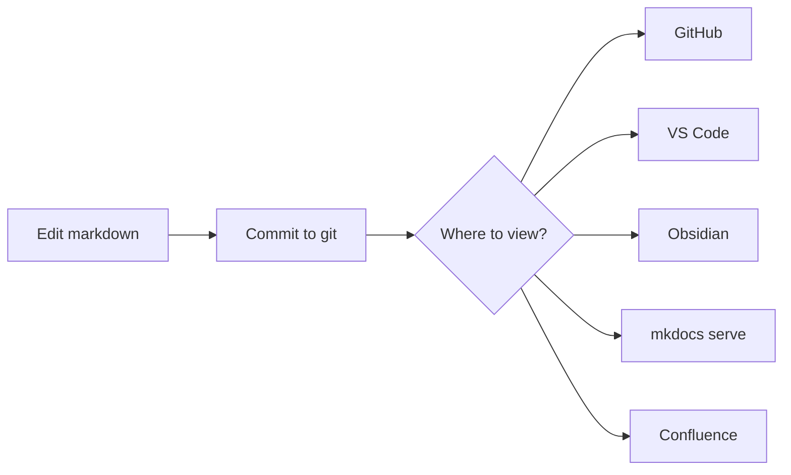
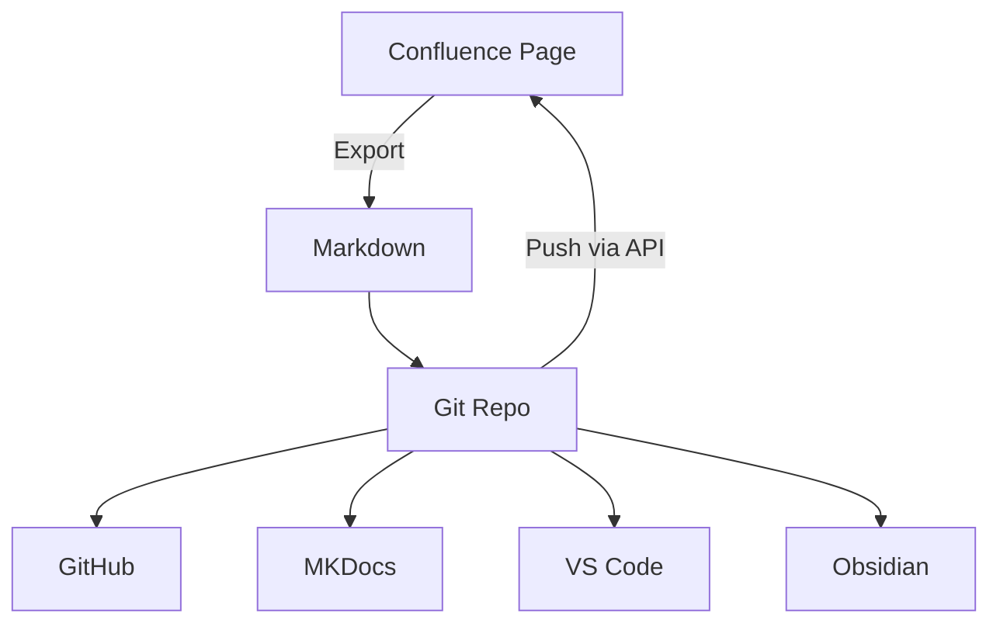
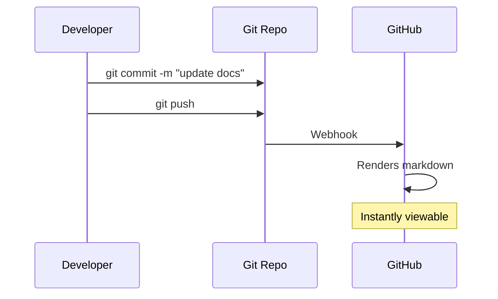
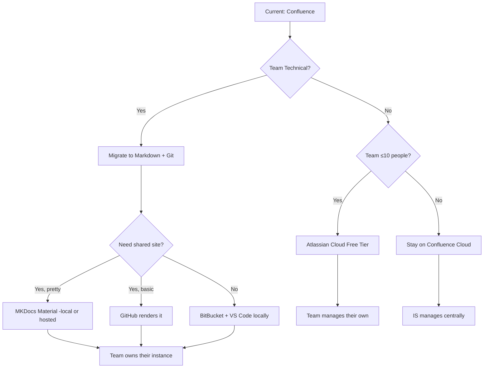

# Documentation Futures for Technical Teams

> **TL;DR**: Just markdown. Just git. Render anywhere.

---

## The Pitch

```
Confluence → Markdown + Git → Render wherever you want
```

The destination isn't MKDocs specifically. It's **markdown as the source of truth**, version controlled in git, rendered by whatever tool fits:

| Renderer | Use Case |
|----------|----------|
| **GitHub** | Good enough (this page),  very cheap teams licensing|
| **VS Code Preview** | While you're editing |
| **Obsidian** | Personal knowledge management, graph view |
| **MKDocs Material** | When you want it pretty |
| **Local `mkdocs serve`** | Fast, offline, no hosting |
| **Confluence** | Push to Confluence via API when needed |

**You're not locked into anything.** Markdown is portable. Git is portable. The renderer is just presentation.

---

## The Workflow



That's it. No WYSIWYG. No database. No vendor lock-in.

---

## What Renders for Free

### GitHub Markdown

GitHub renders markdown beautifully out of the box:
- Headers, lists, tables, code blocks
- Syntax highlighting for any language
- **Mermaid diagrams** (native support since 2022)
- Relative links between docs
- Inline images/gifs, Terminal animations 

### Mermaid Diagrams

No Gliffy. No paid plugins. Just text:





Version controlled. Diffable. No binary blobs.

### Code Blocks

```sql
-- Syntax highlighting just works
SELECT
    d.department_name,
    COUNT(*) as headcount
FROM employees e
JOIN departments d ON e.dept_id = d.id
GROUP BY 1
ORDER BY 2 DESC;
```

```python
# Works for any language
def process_document(path: str) -> dict:
    """AI can read this. Confluence storage format? Not so much."""
    with open(path) as f:
        return parse_markdown(f.read())
```

---

## Audience Fit

Not everything belongs in markdown. Here's the honest breakdown:

| Audience | Skill Level | Best Fit |
|----------|-------------|----------|
| SDDS Technical (AIA, ERP, DDS) | Git-native | **Markdown + Git** |
| Campus IT (broad) | Mixed | Confluence Cloud |
| Non-IT Collaborators | Low | Confluence / TDX |
| Small teams wanting Confluence | Any | Atlassian Cloud Free Tier |

**SDDS doesn't need Confluence for technical docs.** We live in git. Our docs should too.
**Note on Atlassian Free Tier:** Atlassian Cloud is free for up to 10 users, and includes many expensive marketplace apps at no cost. Several departments on campus already do this independently. For small teams that want Confluence features without the campus service overhead, this is a viable option.

---

## The AI Angle

This matters more than people realize:

| Format | AI Can... |
|--------|-----------|
| **Markdown** | Read directly, search, reference, update |
| **Confluence** | Requires export, conversion, loses structure |

A markdown-first knowledge base is immediately usable by AI tools. Every MCP, every code assistant, every search tool understands plaintext markdown.

Confluence storage format is proprietary XML soup.

---

## Conversion Reality

**Confluence → Markdown isn't that hard:**

1. Use the [Markdown Exporter](https://marketplace.atlassian.com/apps/1221351/markdown-exporter-for-confluence) marketplace app, or custom-built (already proofed by Jesse/Brock)
2. Export space as markdown
3. Clean up (AI handles 80% of this)
4. Commit to git

**Markdown → Confluence also works:**

You can push markdown back to Confluence programmatically. Write in markdown, version in git, publish to Confluence for those who need it there.

Example: [Claude Teams UO Deployment - Security Assessment & User Guide](https://confluence.uoregon.edu/spaces/~lampman/pages/658604952/Claude+Teams+UO+Deployment+-+Security+Assessment+User+Guide)

That page is authored in markdown, stored in git, and pushed to Confluence via API. Best of both worlds.

**Gliffy diagrams:**
- Export existing as SVG (one-time)
- New diagrams in Mermaid (text-based, version controlled)
- Complex stuff in draw.io → export SVG

**Note on Mermaid:** GitHub, VS Code, Obsidian and MKDocs render Mermaid natively (free). On-prem Confluence does not—you'd need Cloud + a paid marketplace app. Another reason to keep the source in git and render elsewhere.

Jesse and I have done this. It's not painful.

---

## MKDocs Material (When You Want Pretty)

For documentation that needs polish:

```bash
# Install once
pip install mkdocs-material

# Serve locally
mkdocs serve
# → http://localhost:8000

# That's it.
```

**Features:**
- Beautiful Material Design theme
- Built-in search (client-side, fast)
- Dark mode toggle
- Mobile responsive
- Edit button → links to repo for direct editing

**But you don't need it.** GitHub rendering is often enough.

---

## Recommended Path for SDDS




1. **Don't fight the campus service** — Confluence Cloud for broad IT use is fine
2. **Technical teams go their own way** — We manage our own markdown repos
3. **No central MKDocs service** — Teams own it, no burden on Tyf
4. **Start simple** — GitHub rendering first, MKDocs if needed

---

## Key Points

| Question | Answer |
|----------|--------|
| What's the actual proposal? | Markdown + git. Renderer is optional. |
| Does this replace Confluence? | For technical teams, yes. Campus-wide, no. |
| Who supports it? | Teams own their own repos |
| Is conversion hard? | No. AI helps. We've done it. |
| What about Gliffy? | Mermaid is better and free |
| What about search across teams? | GitHub search, or accept siloed docs |
| Is MKDocs sustainable? | MIT licensed, not VC-backed, stable |

---

## Resources

- [MKDocs Material](https://squidfunk.github.io/mkdocs-material/) — The pretty option
- [Mermaid Live Editor](https://mermaid.live/) — Try diagrams interactively
- [GitHub Markdown Demo](https://github.com/magpieE5/demo) — What renders natively
- [Markdown Exporter](https://marketplace.atlassian.com/apps/1221351/markdown-exporter-for-confluence) — Confluence → Markdown

**People:**
- **Ryan Leonard / NTS** — Already using MKDocs on campus
- **Jesse & Brock** — Experience with Confluence export, happy to help

---

> *The goal isn't to convince everyone to switch. It's to have markdown + git as a legitimate option for teams where it fits.*
