# ✨ Project Showcase — Markdown Sample

A compact, GitHub-friendly sample README that demonstrates common Markdown features you can show your friend: mermaid diagrams, call-outs, admonitions (using GitHub-friendly patterns), fenced code blocks, task lists, tables, collapsible sections, and more.

---

## Table of contents
- [Quick Callouts](#quick-callouts)
- [Mermaid Diagrams](#mermaid-diagrams)
- [Code Samples](#code-samples)
- [Tasks & Table](#tasks--table)
- [Collapsible Admonition](#collapsible-admonition)
- [Notes & Links](#notes--links)

---

## Quick Callouts

> 🔔 **Heads-up:** This blockquote acts as a simple callout. Use it for short warnings or notices.

> ✅ **Note:** Inline `code` looks like this.

For richer, foldable advice use the collapsible sections below.

---

## Mermaid Diagrams

GitHub supports Mermaid diagrams inside fenced code blocks. Example flowchart:

```mermaid
flowchart TD
  A[Start] --> B{Is it awesome?}
  B -->|Yes| C[Celebrate 🎉]
  B -->|No| D[Improve it 🔧]
  C --> E[Share]
  D --> E
```



Sequence diagram example:


Class diagram example:


---

## Code Samples

Bash:

```bash
# Install dependencies (example)
npm install
# Run tests
npm test
```

JavaScript:

```javascript
// greet.js
export function greet(name) {
  return `Hello, ${name}!`;
}

console.log(greet('Friend'));
```

Python:

```python
# hello.py
def greet(name: str) -> str:
    return f"Hello, {name}!"

if __name__ == "__main__":
    print(greet("Friend"))
```

Inline code example: Use `git clone <repo>` to copy the repo locally.

---

## Tasks & Table

- [x] Write sample README
- [ ] Add real project content
- [ ] Share with friend

Contributors table:

| Contributor | Role       | Contact |
|-------------|------------|---------|
| You         | Author     | @your-handle |
| Friend      | Reviewer   | @their-handle |

---

## Collapsible Admonitions

<details>
<summary>💡 Tip — Click to expand</summary>

Use blockquotes for simple admonitions:

> 📌 **Tip:** Prefer short callouts for important notes. Example: *Use `--help` to see available CLI options.*

You can also include code or diagrams inside these collapsible sections.

</details>

<details>
<summary>⚠️ Warning — Expand for caution</summary>

> ⚠️ **Important:** This is a GitHub-friendly pattern for warnings. Avoid unsupported markdown extensions (like `::: warning`) if you want maximum compatibility.

</details>

---

## Example: Small How-to Section

1. Clone the repo:
   ```bash
   git clone https://github.com/yourname/yourrepo.git
   ```
2. Install:
   ```bash
   npm install
   ```
3. Run:
   ```bash
   npm start
   ```

---

## Extra: Quote, Links & Images

> “Simplicity is the soul of efficiency.” — Austin Freeman

Useful links:
- [GitHub Docs — Basic writing and formatting syntax](https://docs.github.com/en/get-started/writing-on-github/basic-writing-and-formatting-syntax)
- [Mermaid Live Editor](https://mermaid.live/) — Quickly preview mermaid diagrams

Small image example:


---

## Closing

This file is designed to be copy-paste-ready for GitHub README usage. If you want a version tailored to a specific project (with badges, CI status, usage examples, or a real repo link), tell me the project name and what sections you'd like included and I'll update it.
